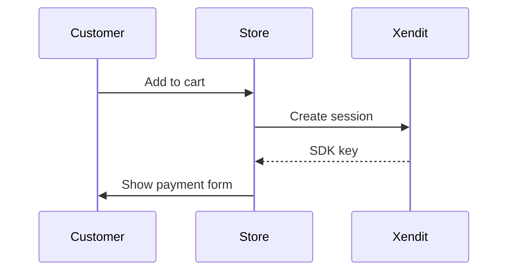

# CLAUDE.md — Xendit Components Guide Project

## Project Context

This is the `xendit-demo-store` repository — a full-stack React/Node.js demo app showcasing Xendit's payment integrations. We are creating a **companion internal guide** (separate repo: `xendit-components-guide`) that documents how to use this codebase, with deep focus on the Components integration mode.

## Architecture — Static Encrypted HTML (v2)

**Previous architecture (v1):** Next.js App Router + NextAuth + Vercel — killed due to package maintenance burden, security surface area, and over-engineering for a docs page.

**New architecture (v2):** Single static HTML file with encrypted content, hosted on GitHub Pages. Zero runtime dependencies. Zero npm packages in production.

### Core Principles
1. **Zero packages in production** — no npm, no frameworks, no server
2. **Content encrypted at rest** — can't read without valid `@xendit.co` Google sign-in
3. **Editable by CSMs** — content sourced from `.md` files, compiled at build time
4. **Mermaid.js for diagrams** — text-based, readable, editable by non-engineers
5. **GitHub Pages hosting** — free, reliable, Git-native workflow

### How It Works

```
┌─────────────────────────────────────────────────────────┐
│  BUILD TIME (local or GitHub Actions)                    │
│                                                         │
│  content/*.md  ──→  build.js  ──→  index.html           │
│  (plaintext)        (Node.js)      (encrypted blob)     │
│                                                         │
│  build.js:                                              │
│    1. Reads all .md files from content/                  │
│    2. Renders Markdown → HTML (with Mermaid blocks)     │
│    3. Encrypts the rendered HTML using AES-GCM          │
│    4. Embeds encrypted blob + auth shell into index.html│
└─────────────────────────────────────────────────────────┘

┌─────────────────────────────────────────────────────────┐
│  RUNTIME (browser)                                       │
│                                                         │
│  1. User visits GitHub Pages URL                         │
│  2. Sees "Sign in with Google" (Google Identity Services)│
│  3. Signs in → Google returns signed JWT id_token       │
│  4. JS verifies hd == "xendit.co" from token claims    │
│  5. Derives decryption key from token + embedded salt   │
│  6. Decrypts content blob → renders into DOM            │
│  7. Mermaid.js initializes → renders diagrams           │
└─────────────────────────────────────────────────────────┘
```

### Security Layers (Defense in Depth)

| Layer | What | Bypass difficulty |
|-------|------|-------------------|
| 1. GCP Internal OAuth | Only `@xendit.co` workspace accounts can get a token | Impossible without Google Workspace admin access |
| 2. AES-GCM encryption | Content is ciphertext until decrypted with key derived from valid token | Requires brute-forcing 256-bit key |
| 3. `hd` claim validation | JS checks hosted domain claim in Google's cryptographically-signed JWT | Requires forging Google's RSA signature |
| 4. No content in source | Encrypted blob is opaque — view-source reveals nothing readable | N/A |

### Crypto Contract (DO NOT BREAK)

The encrypt (build-time) and decrypt (browser-time) formulas **must be identical**. Any change to one side requires the same change to the other, followed by a round-trip test.

```
BUILD TIME (build.js):
  browserPassword = HMAC-SHA256(BUILD_ENCRYPTION_KEY, "xendit-components-guide-v2") → base64
  salt            = randomBytes(16)
  iv              = randomBytes(12)
  key             = PBKDF2(browserPassword, salt, 100000, 32, SHA-256)
  ciphertext      = AES-256-GCM.encrypt(plaintext, key, iv)
  authTag         = cipher.getAuthTag()                    // 16 bytes
  blob            = base64(salt + iv + authTag + ciphertext)
  CONTENT_SALT    = browserPassword   ← injected into template.html

BROWSER TIME (template.html):
  password        = CONTENT_SALT_B64  ← injected at build time (same as browserPassword)
  packed          = base64decode(ENCRYPTED_BLOB)
  salt            = packed[0:16]
  iv              = packed[16:28]
  authTag         = packed[28:44]
  ciphertext      = packed[44:]
  key             = PBKDF2(password, salt, 100000, 32, SHA-256)
  plaintext       = AES-256-GCM.decrypt(ciphertext + authTag, key, iv)
```

**Rule:** Never change `build.js` encryption logic without updating `template.html` decryption to match, and vice versa. Always run `node test-decrypt.js` to verify the round-trip before committing.

### What This Means
- Without a `@xendit.co` Google account: content is AES-encrypted gibberish
- With a valid account: normal reading experience
- A determined insider (has Xendit account) could extract content — but they're authorized anyway

## Finalized Decisions

| Decision | Value |
|----------|-------|
| Repo name | `clm-components-guide` |
| GitHub Pages URL | `https://sabiqovsky.github.io/clm-components-guide` |
| GitHub user | `sabiqovsky` |
| Hosting | GitHub Pages |
| Auth | Google Identity Services (client-side) + AES-GCM content encryption |
| GCP OAuth Client ID | `527936545532-10mmrufrdrkpjlr2l03kgq6fj2d78vu2.apps.googleusercontent.com` |
| GCP OAuth | **Internal** consent screen (Workspace-only) |
| Domain restriction | `@xendit.co` (enforced by GCP + JS `hd` claim check) |
| Content source | Markdown files in `content/` directory |
| Diagrams | Mermaid.js (CDN-loaded at runtime) |
| Build tool | Single `build.js` (Node.js, dev-only dependency) |
| Output | `docs/index.html` (GitHub Pages serves from `/docs`) |
| Guide format | Single-page HTML, sticky nav, 12 sections |
| Timestamp | Auto "Last Updated" generated at build time |
| Section 1 depth | Brief (audience already knows Xendit) |
| PCI messaging | "Xendit handles it" — no SAQ types |
| Custom domain | None — use `sabiqovsky.github.io` |

## Key Files in xendit-demo-store (for guide content)

- `server/integrations/components.ts` — Server-side session creation for Components mode
- `src/integrations/XenditComponents.tsx` — Frontend SDK integration (React wrapper)
- `src/integrations/README.md` — Developer guide for Components frontend
- `server/integrations/README.md` — Server-side integration patterns
- `src/pages/Checkout/Checkout.tsx` — How Components is rendered in checkout
- `server/config.ts` — Origins config, multi-currency API key mapping
- `server/integrations/invoice.ts` — Legacy Invoice API (for migration comparison)
- `server/integrations/payment-link.ts` — Payment Link mode (for comparison)

## Architecture Notes (Components Product)

- **Sessions API** with `mode: "COMPONENTS"` returns a `components_sdk_key`
- **`components_configuration.origins`** restricts which domains can use the SDK key
- **Secure iframe** — card data never touches merchant server or JS
- **Event lifecycle:** init → submission-ready/not-ready → submission-begin → submission-end → session-complete
- **4 flows:** pay, save, pay_save, subscription
- **3 integrations:** session (Payment Link), components, invoice (legacy)
- **8 currencies:** IDR, PHP, MYR, THB, VND, SGD, HKD, MXN

## Project Commands

```bash
# Build the guide (compiles .md → encrypted HTML)
node build.js

# Preview locally (any static server)
npx serve docs/

# Deploy (push to main → GitHub Pages auto-deploys)
git push origin main
```

## Kiro Setup

### Agent Architecture

Two agents operate on this project via Kiro CLI:

| Agent | Role | Skill | Trigger |
|-------|------|-------|---------|
| **Planner** | Designs, plans, clarifies, updates `.md` specs | `clm-revenue`-style (gated workflow) | "plan", "update guide", "change X" |
| **Executor** | Implements code, builds artifacts, runs verification | Direct execution | "go", "execute phase N", "build it" |

### Handoff Protocol

```
Planner:
  1. Gathers requirements (asks questions)
  2. Updates .md files (ONLY after user confirms)
  3. Indexes updated files into knowledge base
  4. Says: "Plan ready. Hand off to executor for Phase N."

Executor:
  1. Searches knowledge base for current plan state
  2. Executes the specified phase
  3. Runs verification steps
  4. Reports back at gate checkpoints
```

### Knowledge Bases

The executor (and planner) can search project context without re-reading files:

| Knowledge Base | Content | Auto-update trigger |
|----------------|---------|---------------------|
| `Components Guide Plan` | `docs/COMPONENTS_GUIDE_PLAN.md` | Any plan change |
| `Components Guide Context` | `CLAUDE.md` | Any architecture/decision change |

After modifying `CLAUDE.md` or `docs/COMPONENTS_GUIDE_PLAN.md`, re-index:
```
knowledge update --path docs/COMPONENTS_GUIDE_PLAN.md --name "Components Guide Plan"
knowledge update --path CLAUDE.md --name "Components Guide Context"
```

### Guardrails

1. **Clarify before writing:** Any instruction that would modify `.md` files requires user confirmation BEFORE changes are made. Show what will change, ask "Shall I apply this?", then write.

2. **Auto-update rule:** When a shared value changes, update ALL `.md` files (see plan for full procedure). But still confirm with user first.

3. **No assumptions:** If a request is ambiguous (scope, audience, technical detail), ask — don't guess.

### Available Tools (Kiro-native)

| Tool | Use for |
|------|---------|
| `knowledge search` | Find decisions, specs, values without re-reading full files |
| `knowledge update` | Re-index after `.md` file changes |
| `cavecrew-investigator` | Locate code/patterns in xendit-demo-store (compressed output) |
| `cavecrew-builder` | Surgical edits (≤2 files, scope known) |
| `cavecrew-reviewer` | Review diffs before committing |

## Repo Structure (v2)

```
xendit-components-guide/
├── content/                    # ✏️ EDIT THESE (Markdown source)
│   ├── 01-big-picture.md
│   ├── 02-getting-started.md
│   ├── 03-integration-compared.md
│   ├── 04-components-e2e.md
│   ├── 05-components-frontend.md
│   ├── 06-components-backend.md
│   ├── 07-styling.md
│   ├── 08-security.md
│   ├── 09-migration.md
│   ├── 10-payment-flows.md
│   ├── 11-webhooks.md
│   └── 12-faq.md
├── build.js                    # Build script (reads .md → outputs encrypted HTML)
├── template.html               # HTML shell (auth UI, Mermaid loader, decryption logic)
├── docs/                       # OUTPUT (GitHub Pages serves this)
│   └── index.html              # Generated — do not edit directly
├── CLAUDE.md                   # This file
├── README.md                   # Setup + contributor guide
└── .github/
    └── workflows/
        └── build.yml           # Optional: auto-build on push
```

## Content Editing Workflow (for CSMs)

```
1. Open content/XX-section-name.md in GitHub UI (or clone locally)
2. Edit the Markdown (add text, update Mermaid diagrams)
3. Commit & push to main
4. GitHub Actions runs build.js → regenerates docs/index.html
5. GitHub Pages deploys automatically
```

### Mermaid Diagram Syntax (for editors)

In any `.md` file, write diagrams as fenced code blocks:

~~~markdown

~~~

These render as interactive diagrams in the final guide.

## Execution Runbook

Full plan: `docs/COMPONENTS_GUIDE_PLAN.md`

The plan is a **gated runbook** with 5 phases (0–4) and 7 confirmation questions.

**Agent handoff:** Planner owns phases 0 (variable collection) and gate confirmations. Executor owns implementation (phases 1–4). Planner re-engages at each gate to verify before authorizing the next phase.

| Phase | What | Owner | Key Gate Question |
|-------|------|-------|-------------------|
| 0 | Variable collection | Planner | Confirm GCP setup, GitHub repo, encryption approach |
| 1 | Build system | Executor | build.js compiles .md → encrypted HTML correctly? |
| 2 | Auth + encryption | Executor | Sign-in flow works? Encryption/decryption verified? |
| 3 | Content + diagrams | Executor | All 12 sections render? Mermaid diagrams correct? |
| 4 | Deploy to GitHub Pages | Executor | Live and verified? |

### Determinism Rules
- Zero npm packages in production output
- All code snippets sourced from actual xendit-demo-store files
- No speculative features — only what exists in the codebase
- Content rules: 200-600 words per section, mid-level CSM audience
- Mermaid diagrams must be readable and accurate
- Every phase has explicit verification criteria before gate

### Auto-Update Rule
When any value shared across `.md` files changes (e.g., repo name, auth method, section count, hosting), the executor MUST update ALL three files (`CLAUDE.md`, `README.md`, `docs/COMPONENTS_GUIDE_PLAN.md`) to stay consistent. Full procedure documented in the plan under "Auto-Update Rule: Cross-File Consistency."

### Post-Migration Cleanup
Once v2 is live and stable, strip v1 comparison context (tables, migration checklists) from all `.md` files. Keep only forward-looking documentation. Full checklist in the plan under "Post-Migration Cleanup."
