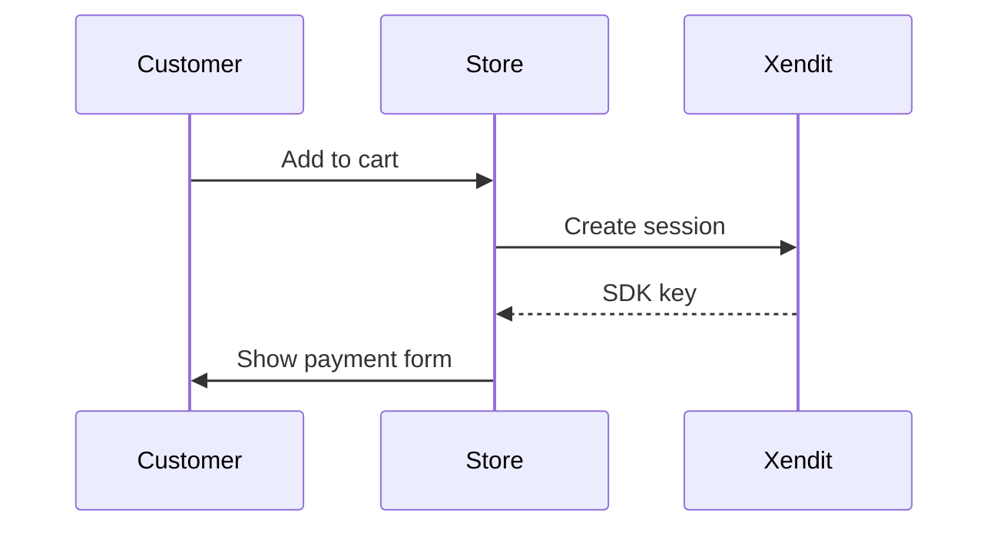

# clm-components-guide

Internal guide for Xendit CSM and CIM teams. Covers the `xendit-demo-store` codebase and the Components integration — architecture, security, migration, styling, and all 4 payment flows.

**Access is restricted to `@xendit.co` Google accounts.**

## Live URL

`https://sabiqovsky.github.io/clm-components-guide`

---

## Architecture

Single static HTML file. Zero frameworks. Zero server. Zero npm packages in production.

```
content/*.md  ──→  build.js  ──→  docs/index.html (encrypted)
                                        ↓
                              GitHub Pages serves it
                                        ↓
                         User signs in with Google (@xendit.co)
                                        ↓
                            Content decrypted in browser
```

### Security Model

| Layer | Protection |
|-------|-----------|
| GCP Internal OAuth | Only `@xendit.co` accounts can authenticate |
| AES-GCM encryption | Page content is encrypted at rest — unreadable without valid sign-in |
| JWT `hd` claim | Google's cryptographic signature proves the user's domain |
| No plaintext in source | `docs/index.html` contains only ciphertext + auth shell |

---

## For Content Editors (CSMs)

### Editing Content

All guide content lives in `content/*.md`. To update:

1. Navigate to the file on GitHub (e.g., `content/08-security.md`)
2. Click the pencil icon (Edit)
3. Make your changes in Markdown
4. Commit directly to `main`
5. GitHub Actions rebuilds and deploys automatically (~1 min)

### Adding Diagrams

Use Mermaid syntax inside any `.md` file:

~~~markdown

~~~

Common diagram types:
- `sequenceDiagram` — for flows and interactions
- `flowchart LR` — for decision trees and processes
- `graph TD` — for architecture/hierarchy

Reference: [Mermaid syntax docs](https://mermaid.js.org/intro/)

### Content Structure

```
content/
├── 01-big-picture.md           # What is this demo store?
├── 02-getting-started.md       # Repo setup & running locally
├── 03-integration-compared.md  # Payment Link vs Components vs Invoice
├── 04-components-e2e.md        # End-to-end flow walkthrough
├── 05-components-frontend.md   # Front-end SDK integration
├── 06-components-backend.md    # Server-side session creation
├── 07-styling.md               # Styling & customisation
├── 08-security.md              # Security & PCI-DSS
├── 09-migration.md             # Migrating from legacy
├── 10-payment-flows.md         # Pay/Save/PaySave/Subscription
├── 11-webhooks.md              # Webhooks & async confirmation
└── 12-faq.md                   # Merchant FAQs
```

---

## For Developers

### Prerequisites

- Node.js 18+ (build-time only — not needed for deployment)
- A GCP OAuth Client ID (Internal consent screen)

### Local Setup

```bash
git clone <this-repo>
cd xendit-components-guide

# Build the guide
node build.js

# Preview locally
npx serve docs/
# Visit http://localhost:3000
```

### How the Build Works

`build.js` (single file, no dependencies beyond Node.js built-ins + one markdown lib):

1. Reads all `content/*.md` files in order
2. Converts Markdown → HTML (preserving Mermaid code blocks for client-side rendering)
3. Generates a table of contents from `# headings`
4. Encrypts the rendered HTML using AES-256-GCM with a key derived from a build secret
5. Injects the encrypted blob into `template.html`
6. Outputs `docs/index.html`

### How Auth + Decryption Works (Runtime)

1. Browser loads `docs/index.html` — shows only a sign-in button
2. User clicks "Sign in with Google" (Google Identity Services SDK, loaded from Google's CDN)
3. Google returns a signed JWT `id_token`
4. JS extracts the `hd` (hosted domain) claim, verifies it equals `xendit.co`
5. Derives the AES decryption key from the token's `hd` claim + embedded salt
6. Decrypts the content blob → injects into DOM
7. Mermaid.js (loaded from CDN) renders all diagram blocks

### Environment / Config

| Variable | Where | Description |
|----------|-------|-------------|
| `GOOGLE_CLIENT_ID` | Hardcoded in `template.html` | GCP OAuth Client ID (not a secret — it's public) |
| `BUILD_ENCRYPTION_KEY` | GitHub Actions secret / local env | Used by `build.js` to encrypt content |

The `GOOGLE_CLIENT_ID` is safe to commit publicly — even in a public repo. It only identifies the OAuth app to Google; it cannot grant access or be used to impersonate users. The GCP project's **Internal** consent screen ensures only `@xendit.co` Workspace users can authenticate. The `BUILD_ENCRYPTION_KEY` (the actual secret that encrypts content) lives only in GitHub Actions secrets and is never in the repo.

### Deploy

Deployment is automatic via GitHub Pages:

1. Push to `main`
2. GitHub Actions runs `build.js`
3. Commits updated `docs/index.html`
4. GitHub Pages serves `/docs` folder

#### Manual deploy

```bash
node build.js
git add docs/index.html
git commit -m "rebuild guide"
git push origin main
```

### GitHub Pages Setup (one-time)

1. Go to repo **Settings → Pages**
2. Source: **Deploy from a branch**
3. Branch: `main`, folder: `/docs`
4. Save

---

## Google Cloud OAuth Setup (one-time)

1. Go to [Google Cloud Console → Credentials](https://console.cloud.google.com/apis/credentials)
2. Create/select project: `xendit-internal-tools`
3. Configure OAuth consent screen:
   - User type: **Internal** (restricts to Google Workspace org — critical!)
   - App name: `Xendit Components Guide`
4. Create OAuth Client ID:
   - Type: **Web application**
   - Authorized JavaScript origins:
     - `http://localhost:3000` (dev)
     - `https://<org-or-user>.github.io` (prod)
   - No redirect URIs needed (using token-based flow, not auth code)
5. Copy the Client ID → put in `template.html`

---

## Why This Architecture?

| Concern | Previous (Next.js) | Current (Static HTML) |
|---------|--------------------|-----------------------|
| Packages to maintain | ~40 npm deps | 0 in production |
| Security surface | Framework + auth lib + server | Google CDN + Web Crypto API |
| Deployment complexity | Vercel + env vars + builds | `git push` |
| Content editing | Edit React components (TSX) | Edit Markdown files |
| Diagram editing | Edit SVG code manually | Write Mermaid text |
| Hosting cost | Free (Vercel) | Free (GitHub Pages) |
| Can break from updates | Yes (Next.js, NextAuth, React) | No (zero deps) |

---

## Project Structure

```
xendit-components-guide/
├── content/                    # ✏️ EDITABLE — Markdown source files
│   ├── 01-big-picture.md
│   ├── ...
│   └── 12-faq.md
├── build.js                    # Build script (dev-only)
├── template.html               # HTML shell (auth + decryption logic)
├── docs/                       # OUTPUT — GitHub Pages serves this
│   └── index.html              # Generated (do not edit directly)
├── .github/workflows/
│   └── build.yml               # Auto-build on push to main
├── CLAUDE.md                   # AI context / architecture doc
└── README.md                   # This file
```
