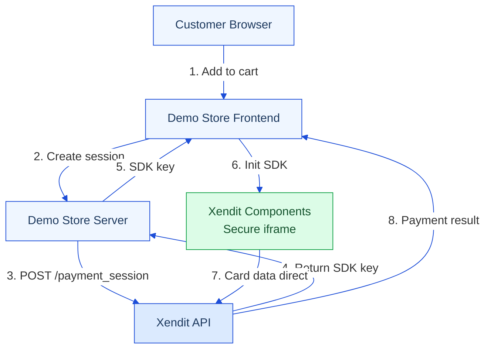

# What is the Xendit Demo Store?

The `xendit-demo-store` is a full-stack reference implementation that demonstrates all three of Xendit's payment integration modes in a single, runnable codebase. It's built as a fictional plushie e-commerce store — but its real purpose is to show exactly how each integration works end-to-end.

## Three Integration Modes

| Integration | How it works | Where the customer pays |
|-------------|-------------|------------------------|
| **Payment Link** | Merchant creates a session; Xendit returns a hosted URL | Redirected to Xendit-hosted page |
| **Components** | Merchant creates a session; SDK key returned; iframe renders on merchant's page | Stays on merchant's page |
| **Invoice (Legacy)** | Older API; creates a Xendit-hosted invoice page | Redirected to Xendit-hosted page |

This guide focuses on **Components** — the embedded mode that gives merchants the most brand control while Xendit handles all PCI-DSS scope.

## Four Payment Flows

| Flow | `session_type` | What happens |
|------|----------------|-------------|
| **Pay** | `PAY` | One-time charge at checkout |
| **Save** | `SAVE` | Saves card without charging |
| **Pay + Save** | `PAY` + `allow_save_payment_method` | Charges and optionally saves |
| **Subscription** | `SUBSCRIPTION` | Sets up recurring billing |

## Eight Currencies

IDR, PHP, MYR, THB, VND, SGD, HKD, MXN — each mapped to a separate Xendit API key in the server config.

## Architecture Overview

The key insight: **card data never touches the merchant's server or JavaScript.**
