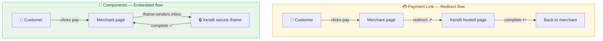

# Integration Methods Compared

## Comparison Table

| | Payment Link | Components | Invoice (Legacy) |
|--|-------------|------------|-----------------|
| **Where customer pays** | Xendit-hosted page | Merchant's own page | Xendit-hosted page |
| **Brand control** | None | High | None |
| **PCI scope** | Xendit handles | Xendit handles | Xendit handles |
| **Setup effort** | Low | Medium | Low |
| **Supported flows** | Pay | Pay, Save, Pay+Save, Subscription | Pay |
| **Redirect?** | Yes | No | Yes |
| **Best for** | Quick integration | Full control + multiple flows | Legacy only |

## Flow Comparison

## When to Recommend Each

**Recommend Components when:**
- Merchant wants customers to stay on their site
- Merchant needs Save, Pay+Save, or Subscription flows
- Merchant has dev resources and wants brand consistency

**Recommend Payment Link when:**
- Merchant needs to go live fast with minimal dev effort
- Simple one-time pay flow only

**Recommend Invoice when:**
- Never for new integrations — this is legacy
- Only if already on Invoice and migration isn't prioritized
