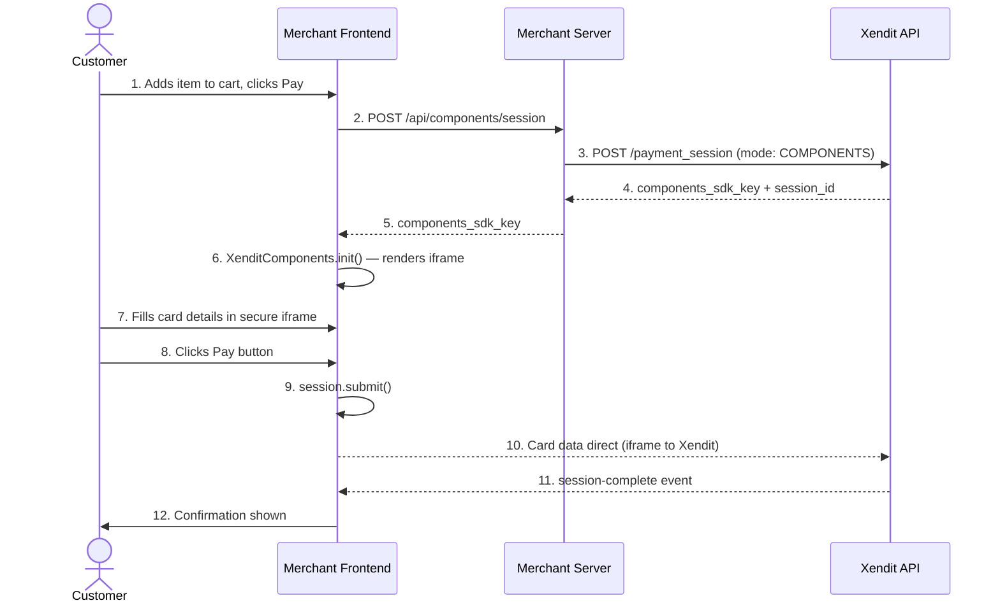

# Components: End-to-End Flow

## The Full Sequence

## Step-by-Step Breakdown

**Steps 1–2:** Customer initiates checkout. Frontend calls its own backend — no Xendit credentials in the browser yet.

**Steps 3–4:** Server calls Xendit Sessions API with `mode: "COMPONENTS"`. Xendit returns a short-lived `components_sdk_key` scoped to this session.

**Steps 5–6:** SDK key is passed to the browser. The Xendit Components SDK initializes and renders a channel picker + card fields inside a secure iframe hosted on Xendit's domain.

**Steps 7–8:** Customer fills card details inside the iframe. The merchant's JavaScript cannot read these values — enforced by browser cross-origin policy.

**Steps 9–10:** Merchant calls `session.submit()` on pay button click. Card data goes directly from the iframe to Xendit. The merchant server is not in this path.

**Steps 11–12:** Xendit fires `session-complete`. Merchant shows confirmation.

> **Key point:** Card data never passes through the merchant's server or JavaScript. This is the entire basis of the PCI-DSS benefit.
