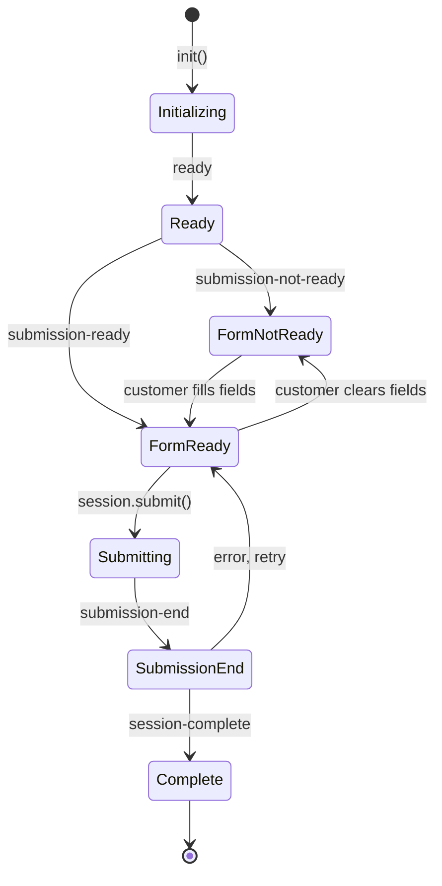

# Components: Front-End Integration

## SDK Initialization

```javascript
const xenditComponents = XenditComponents.init({
  sdkKey: componentsSDKKey,
});
```

## Mounting Components

```javascript
const channelPicker = xenditComponents.create('CHANNEL_PICKER');
channelPicker.mount('#channel-picker-container');
```

## Event Lifecycle



## Event Reference

| Event | When it fires | What to do |
|-------|--------------|-----------|
| `ready` | SDK initialized | Show the form |
| `submission-ready` | All required fields filled | Enable pay button |
| `submission-not-ready` | Form incomplete | Disable pay button |
| `submission-begin` | Processing started | Show loading state |
| `submission-end` | Processing finished | Hide loading state |
| `session-complete` | Payment succeeded | Show confirmation |
| `action-begin` | 3DS/OTP challenge starting | Show action container |
| `action-end` | Challenge complete | Hide action container |

## Listening to Events

```javascript
xenditComponents.on('submission-ready', () => {
  payButton.disabled = false;
});

xenditComponents.on('submission-not-ready', () => {
  payButton.disabled = true;
});

xenditComponents.on('session-complete', (data) => {
  console.log(data.status); // 'SUCCEEDED'
  showConfirmation();
});
```

## Triggering Submission

```javascript
payButton.addEventListener('click', () => {
  xenditComponents.session.submit();
});
```

## Action Container (3DS/OTP)

```javascript
const actionContainer = xenditComponents.create('ACTION_CONTAINER');
actionContainer.mount('#action-container');

xenditComponents.on('action-begin', () => {
  document.getElementById('action-container').style.display = 'block';
});

xenditComponents.on('action-end', () => {
  document.getElementById('action-container').style.display = 'none';
});
```
