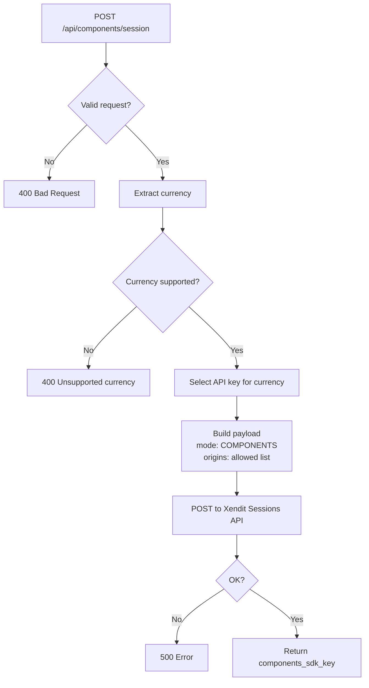

# Components: Back-End Integration

## Session Creation

```javascript
const response = await xenditClient.post('/payment_session', {
  amount: orderAmount,
  currency: orderCurrency,
  payment_method_types: ['CARD'],
  mode: 'COMPONENTS',
  components_configuration: {
    origins: allowedOrigins,
  },
  metadata: { order_id: orderId },
});

const { components_sdk_key, id: sessionId } = response.data;
```

## Origins Configuration

`origins` restricts which domains can use the SDK key. Critical security control:

```javascript
const allowedOrigins = [
  'http://localhost:5173',
  'https://your-store.com',
];
```

If the SDK key is used from a domain not in this list, Xendit rejects the request.

## Multi-Currency API Key Mapping

```javascript
const API_KEYS = {
  IDR: process.env.XENDIT_SECRET_KEY_IDR,
  PHP: process.env.XENDIT_SECRET_KEY_PHP,
  MYR: process.env.XENDIT_SECRET_KEY_MYR,
  THB: process.env.XENDIT_SECRET_KEY_THB,
  VND: process.env.XENDIT_SECRET_KEY_VND,
  SGD: process.env.XENDIT_SECRET_KEY_SGD,
  HKD: process.env.XENDIT_SECRET_KEY_HKD,
  MXN: process.env.XENDIT_SECRET_KEY_MXN,
};

const apiKey = API_KEYS[orderCurrency];
```

## Server Decision Flow



## What to Keep Secret vs What to Share

| Value | Secret? | Reason |
|-------|---------|--------|
| Xendit secret API key | ✅ Server only | Full account access if leaked |
| `components_sdk_key` | ❌ Send to browser | Single-use, session-scoped, short-lived |
| `session_id` | ❌ Safe to expose | Read-only reference |
| Origins list | ❌ Not sensitive | Just a domain allowlist |
