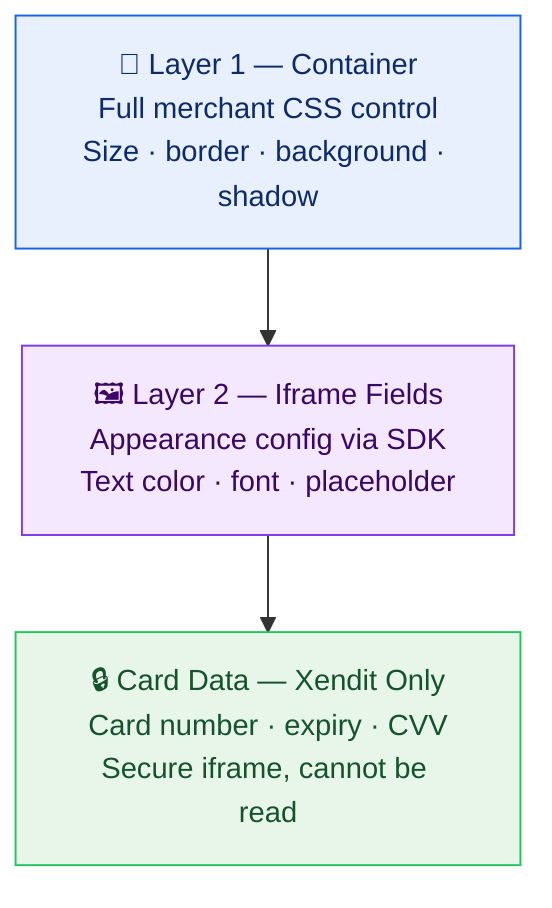

# Styling & Customisation

## The Two-Layer Model



## Layer 1: Container CSS

The outer container is a plain HTML element — style it freely:

```css
#xendit-components-container {
  width: 100%;
  max-width: 480px;
  border: 1px solid #e0e0e0;
  border-radius: 8px;
  padding: 24px;
  background: #ffffff;
  box-shadow: 0 2px 8px rgba(0, 0, 0, 0.08);
}
```

## Layer 2: Appearance Config

Pass `iframeFieldAppearance` when initializing the SDK:

```javascript
const xenditComponents = XenditComponents.init({
  sdkKey: componentsSDKKey,
  iframeFieldAppearance: {
    variables: {
      colorPrimary: '#1762ee',
      colorBackground: '#ffffff',
      colorText: '#1a1f36',
      colorTextPlaceholder: '#9ba3af',
      colorBorder: '#d1d5db',
      fontFamily: 'Inter, sans-serif',
      borderRadius: '6px',
    },
  },
});
```

## The Pay Button

The pay button is **entirely the merchant's own element**. Full control — font, color, states, loading animation.

```html
<button id="pay-button" class="your-own-styles">
  Pay IDR 150,000
</button>
```

## What Can and Cannot Be Customised

| Element | Customisable? | Method |
|---------|--------------|--------|
| Container size, border, background | ✅ Fully | Merchant CSS |
| Input text color | ✅ | `iframeFieldAppearance` |
| Input font | ✅ | `iframeFieldAppearance` |
| Input background | ✅ | `iframeFieldAppearance` |
| Pay button | ✅ Fully | Merchant CSS |
| Card network logos | ❌ | Xendit-controlled |
| Field labels ("Card Number") | ❌ | Xendit-controlled |
| Error message text | ❌ | Xendit-controlled |
