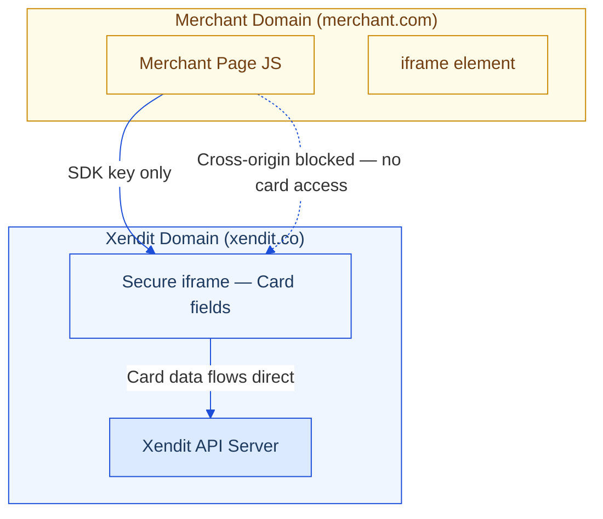

# Security & PCI-DSS

## The Core Principle

When a merchant uses Components, Xendit's secure iframe handles all card data. The merchant's JavaScript, server, and database never see raw card numbers, expiry dates, or CVV codes.

**Use Components = Xendit handles PCI for you.**

## How the Secure Iframe Works

The iframe is hosted on `xendit.co`. Browser cross-origin policy makes it impossible for merchant JavaScript to read values inside — enforced by the browser, not by policy.

## What Merchants Get For Free

- ✅ Card data never stored on merchant servers
- ✅ Card data never passes through merchant's network
- ✅ Card data never accessible in merchant's JavaScript
- ✅ Tokenization handled by Xendit
- ✅ 3DS/OTP challenges handled via action container
- ✅ Card network compliance managed by Xendit

## Security Comparison

| | Legacy (Invoice/direct) | Components |
|-|------------------------|------------|
| Card data in merchant JS? | Possible | ❌ Impossible (cross-origin) |
| Card data on merchant server? | Risk if not careful | ❌ Never |
| 3DS handling | Merchant implements | Xendit handles |
| Tokenization | Merchant may need to store | Xendit handles |

## Merchant Conversation Talking Points

**"We already handle payments — why change?"**
> If card data touches your current flow, you carry PCI scope. Components removes that entirely.

**"Is it secure if the JS is on our page?"**
> Yes. The card fields are inside an iframe on Xendit's domain. Your JavaScript cannot read across origins — this is browser-enforced. Even if your page JS were fully compromised, card data inside the iframe is inaccessible.

**"What if someone steals the SDK key?"**
> It's a single-use, session-scoped token. It can only render a payment form — not charge cards directly. And `origins` config means it only works on your own domain.
