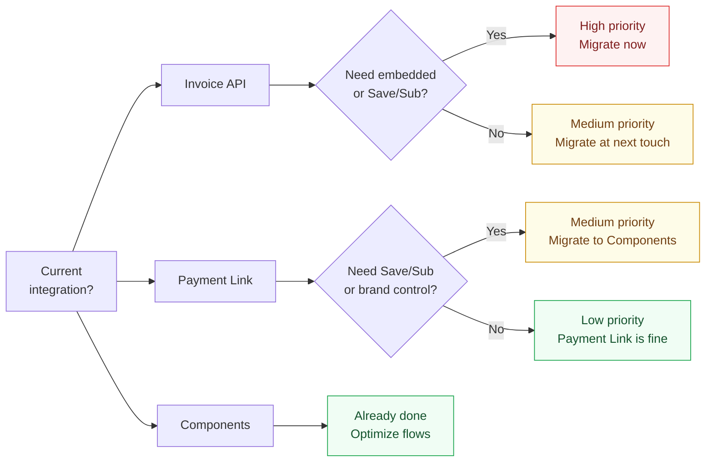

# Migrating from Legacy to Components

## Who Should Migrate?



## Decision Matrix

| Merchant Type | Recommended Path | Effort |
|---------------|-----------------|--------|
| On Invoice, has dev resources | Migrate to Components now | Medium |
| On Invoice, no dev resources | Stay, plan migration | Low now |
| On Payment Link, wants Save flow | Migrate to Components | Medium |
| On Payment Link, pay-only is fine | No migration needed | — |

## Migration Steps: Invoice → Components

1. Audit current flow — where Invoice API is called, where card data flows
2. Create Components session endpoint on server
3. Replace frontend redirect with SDK initialization
4. Mount channel picker and card form
5. Wire up events (`submission-ready`, `session-complete`, error handling)
6. Add action container for 3DS
7. Test all flows
8. Update webhook handler (event names differ between Invoice and Components)

## Code Comparison

**Invoice (legacy) — server:**
```javascript
const invoice = await xendit.Invoice.create({
  externalID: orderId,
  amount: orderAmount,
  payerEmail: customerEmail,
});
// Frontend redirects to invoice.invoiceUrl
```

**Components — server:**
```javascript
const session = await xendit.post('/payment_session', {
  amount: orderAmount,
  currency: orderCurrency,
  mode: 'COMPONENTS',
  components_configuration: { origins: allowedOrigins },
});
// Frontend initializes SDK with session.components_sdk_key
```

## Common Pitfalls

| Pitfall | How to avoid |
|---------|-------------|
| Forgetting `origins` config | Always set origins in session creation |
| Pay button still triggers redirect | Use `session.submit()` instead |
| Not handling `submission-not-ready` | Disable pay button until `submission-ready` |
| Missing action container | Mount `ACTION_CONTAINER`, handle `action-begin`/`action-end` |
| Webhook event names changed | Check Components webhook docs separately |
