# Payment Flows

Components supports four distinct flows, all driven by session parameters.

## Flow Overview

```mermaid
flowchart TD
    subgraph PAY["Pay — One-time charge"]
        direction LR
        P1["session_type: PAY"] --> P2["Customer charged once"]
    end
    subgraph SAVE["Save — Vault card, no charge"]
        direction LR
        S1["session_type: SAVE"] --> S2["Card tokenized, no charge"]
    end
    subgraph PAYSAVE["Pay + Save"]
        direction LR
        PS1["session_type: PAY\nallow_save: OPTIONAL"] --> PS2["Charged + card saved"]
    end
    subgraph SUB["Subscription — Recurring"]
        direction LR
        SB1["session_type: SUBSCRIPTION\n+ schedule config"] --> SB2["Recurring billing set up"]
    end

    style PAY fill:#eff6ff,stroke:#1d4ed8,color:#1e3a5f
    style SAVE fill:#faf5ff,stroke:#7c3aed,color:#3b0764
    style PAYSAVE fill:#fefce8,stroke:#ca8a04,color:#713f12
    style SUB fill:#f0fdf4,stroke:#16a34a,color:#14532d
```



## Flow Reference

| Flow | `session_type` | `allow_save_payment_method` | Has `amount`? | Use case |
|------|----------------|----------------------------|---------------|---------|
| Pay | `PAY` | Not set | ✅ Required | Standard checkout |
| Save | `SAVE` | Not set | ❌ No charge | Vault card for later |
| Pay + Save | `PAY` | `OPTIONAL` or `REQUIRED` | ✅ Required | Checkout + save card |
| Subscription | `SUBSCRIPTION` | Not set | Depends on schedule | Recurring billing |

## Pay Flow

Standard one-time charge:

```javascript
{
  amount: 150000,
  currency: 'IDR',
  mode: 'COMPONENTS',
  session_type: 'PAY',
}
```

## Save Flow

Tokenize a card without charging — useful for setting up a payment method for later:

```javascript
{
  currency: 'IDR',
  mode: 'COMPONENTS',
  session_type: 'SAVE',
  // no amount field
}
```

## Pay + Save Flow

Charge and give the customer the option to save their card:

```javascript
{
  amount: 150000,
  currency: 'IDR',
  mode: 'COMPONENTS',
  session_type: 'PAY',
  allow_save_payment_method: 'OPTIONAL', // or 'REQUIRED'
}
```

`OPTIONAL` shows a "Save card" checkbox. `REQUIRED` always saves.

## Subscription Flow

Sets up recurring billing. Requires a schedule configuration:

```javascript
{
  currency: 'IDR',
  mode: 'COMPONENTS',
  session_type: 'SUBSCRIPTION',
  subscription_details: {
    interval: 'MONTH',
    interval_count: 1,
    total_recurrence: 12,
  },
}
```
