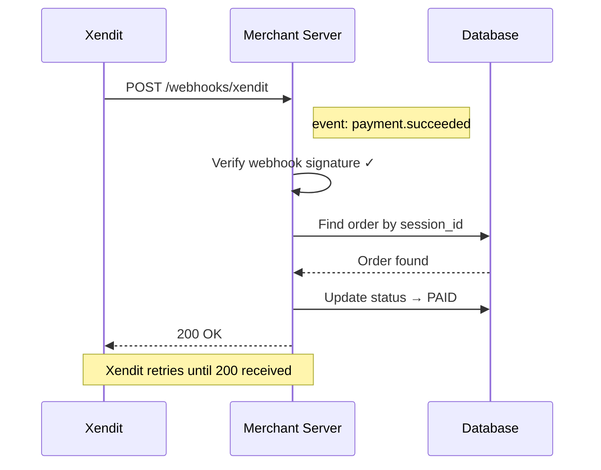

# Webhooks & Async Confirmation

## Why Webhooks Matter

The `session-complete` browser event tells your frontend the payment succeeded. But this is client-side — it can fail silently if the browser closes or connectivity drops. Webhooks are the authoritative, server-side confirmation.

**Rule:** Never fulfill an order based on a browser event alone. Always confirm via webhook.

## Webhook Flow



## Verifying the Webhook Signature

Always verify that the webhook came from Xendit — never process unverified webhooks:

```javascript
const crypto = require('crypto');

function verifyWebhook(rawBody, signatureHeader, webhookToken) {
  const expected = crypto
    .createHmac('sha256', webhookToken)
    .update(rawBody)
    .digest('hex');
  return crypto.timingSafeEqual(
    Buffer.from(expected),
    Buffer.from(signatureHeader)
  );
}
```

The `webhookToken` is set in your Xendit Dashboard under Webhook settings.

## Handling Idempotency

Xendit may deliver the same webhook more than once (retries on non-200 responses). Your handler must be idempotent:

```javascript
app.post('/webhooks/xendit', async (req, res) => {
  const { event, data } = req.body;

  if (event === 'payment.succeeded') {
    const order = await db.orders.findBySessionId(data.session_id);

    // Idempotency check — skip if already processed
    if (order.status === 'PAID') {
      return res.sendStatus(200);
    }

    await db.orders.updateStatus(order.id, 'PAID');
  }

  res.sendStatus(200);
});
```

## Important Note on the Demo Store

The `xendit-demo-store` does **not** implement webhooks — it's a frontend-focused demo. In production, webhooks are mandatory for reliable order fulfillment.

## Webhook Events Reference

| Event | When | Action |
|-------|------|--------|
| `payment.succeeded` | Payment completed | Mark order as paid, fulfill |
| `payment.failed` | Payment failed | Mark order as failed, notify customer |
| `payment_method.activated` | Card saved (Save flow) | Store payment method reference |
